# DocumentacionFinalEParking
Documento de Arquitectura de Software (DAS)

**Proyecto**

<EParking>

**Arquitectos**

<Estefania Otalvaro Quintero>

# Control de cambios y revisiones

|**Versión**|**Fecha**|**Tipo**|**Descripción**|**Autor**|
| - | - | - | - | - |
|**1**|19/04/2026|Creación|Versión inicial del documento|Eusebio Cuartas|
|**2**|15/04/2026|Revisión|Se registran novedades de la revisión|Armando Contreras|
|**3**|18/05/2026|Aprobación|Aprobación versión 3 del documento|Camilo García|

# Contenido
[Control de cambios y revisiones	2](#_toc149220449)

[1.	(NO) Propósito del proyecto	14](#_toc149220450)

[2.	Motivadores de la arquitectura	14](#_toc149220451)

[2.1	Restricciones técnicas	14](#_toc149220452)

[2.2	Restricciones de negocio	14](#_toc149220453)

[2.3	Atributos de calidad	14](#_toc149220454)

[2.3.1	Atributo calidad 1	14](#_toc149220455)

[2.3.1.1	Característica 1	14](#_toc149220456)

[2.3.1.1.1	Escenario de calidad 1	14](#_toc149220457)

[2.3.1.1.2	Escenario de calidad 2	14](#_toc149220458)

[2.3.1.1.3	Escenario de calidad 3	14](#_toc149220459)

[2.3.1.1.N Escenario de calidad N	14](#_toc149220460)

[2.3.1.2	Característica 2	15](#_toc149220461)

[2.3.1.2.1	Escenario de calidad 1	15](#_toc149220462)

[2.3.1.2.2	Escenario de calidad 2	15](#_toc149220463)

[2.3.1.2.3	Escenario de calidad 3	15](#_toc149220464)

[2.3.1.2.N Escenario de calidad N	15](#_toc149220465)

[2.3.2	Atributo calidad 2	15](#_toc149220466)

[2.3.2.1	Característica 1	15](#_toc149220467)

[2.3.2.1.1	Escenario de calidad 1	15](#_toc149220468)

[2.3.2.1.2	Escenario de calidad 2	15](#_toc149220469)

[2.3.2.1.3	Escenario de calidad 3	15](#_toc149220470)

[2.3.2.1.N Escenario de calidad N	15](#_toc149220806)

[2.3.2.2	Característica 2	15](#_toc149220807)

[2.3.2.2.1	Escenario de calidad 1	16](#_toc149220808)

[2.3.2.2.2	Escenario de calidad 2	16](#_toc149220809)

[2.3.2.2.3	Escenario de calidad 3	16](#_toc149220810)

[2.3.2.1.N Escenario de calidad N	16](#_toc149220811)

[2.4	Funcionalidades críticas	16](#_toc149220812)

[3.	Tácticas y estrategias	16](#_toc149220813)

[4.	Modelo de contexto	16](#_toc149220814)

[5.	Arquetipo de solución/referencia	16](#_toc149220815)

[6.	Arquitectura de solución/referencia	16](#_toc149220816)

[7.	Línea base arquitectónica	16](#_toc149220817)

[7.1	Línea base arquitectónica de componentes	17](#_toc149220818)

[7.1.1	Componente 1	17](#_toc149220819)

[7.1.2	Componente 1	17](#_toc149220820)

[7.2	Estilos y patrones arquitectónicos adoptados	17](#_toc149220821)

[7.2.1	Estilo arquitectónico 1	17](#_toc149220822)

[7.2.1.1	Nombre	17](#_toc149220823)

[7.2.1.2	Problema	17](#_toc149220824)

[7.2.1.3	Solución/Motivación	17](#_toc149220825)

[7.2.2	Estilo arquitectónico 2	17](#_toc149220826)

[7.2.2.1	Nombre	17](#_toc149220827)

[7.2.2.2	Problema	17](#_toc149220828)

[7.2.2.3	Solución/Motivación	17](#_toc149220829)

[7.2.N Estilo arquitectónico 2	17](#_toc149220830)

[7.2.N.1 Nombre	17](#_toc149220831)

[7.2.N.2 Problema	18](#_toc149220832)

[7.2.N.3 Solución/Motivación	18](#_toc149220833)

[8.	Justificación alternativa de solución	18](#_toc149220834)

[8.1	Justificación	18](#_toc149220835)

[8.2	Ventajas	18](#_toc149220836)

[8.3	Desventajas	18](#_toc149220837)

[9.	Vistas de arquitectura del sistema	18](#_toc149220838)

[9.1	(NO) Vista Funcional/Vista de Escenarios/Vista de Casos de Uso	18](#_toc149220839)

[9.1.1	Modelo de procesos del negocio	18](#_toc149220840)

[9.1.2	Modelado de dominio	18](#_toc149220841)

[9.1.3	Modelo de contextos	18](#_toc149220842)

[9.1.3.1	Diagrama	18](#_toc149220843)

[9.1.3.2	Documentación contextos	18](#_toc149220844)

[9.1.4	Modelo de mapeo de contextos	19](#_toc149220845)

[9.1.4.1	Diagrama	19](#_toc149220846)

[9.1.4.2	Documentación mapeo de contextos	19](#_toc149220847)

[9.1.5	Modelos de dominio	19](#_toc149220848)

[9.1.5.1	Contexto 1	19](#_toc149220849)

[9.1.5.2	Modelo anémico	19](#_toc149220850)

[9.1.5.3	Modelo enriquecido	19](#_toc149220851)

[9.1.5.4	Contexto 2	19](#_toc149220852)

[9.1.5.5	Modelo anémico	19](#_toc149220853)

[9.1.5.6	Modelo enriquecido	19](#_toc149220854)

[9.1.5.7	Contexto 3	19](#_toc149220855)

[9.1.5.8	Modelo anémico	20](#_toc149220856)

[9.1.5.9	Modelo enriquecido	20](#_toc149220857)

[9.1.5.10	Contexto N	20](#_toc149220858)

[9.1.5.11	Modelo anémico	20](#_toc149220859)

[9.1.5.12	Modelo enriquecido	20](#_toc149220860)

[9.1.6	Flujo de eventos/Event Storming	20](#_toc149220861)

[9.1.6.1	Diagrama	20](#_toc149220862)

[9.1.6.2	Especificación	20](#_toc149220863)

[9.1.7	Glosario de términos del negocio	20](#_toc149220864)

[9.1.8	Especificación de requisitos de software	20](#_toc149220865)

[9.1.8.1	Requisitos de usuario	20](#_toc149220866)

[9.1.8.2	Requisitos del sistema	21](#_toc149220867)

[9.1.8.2.1	Requisitos funcionales	21](#_toc149220868)

[9.1.8.2.2	Requisitos no funcionales	21](#_toc149220869)

[9.1.8.2.3	Requisitos de información	21](#_toc149220870)

[9.1.8.2.4	Reglas de negocio	21](#_toc149220871)

[9.1.9	Casos de uso	21](#_toc149220872)

[9.1.9.1	Modelo de contexto	21](#_toc149220873)

[9.1.9.1.1	Diagrama	21](#_toc149220874)

[9.1.9.1.2	Descripción	21](#_toc149220875)

[9.1.9.2	Diagramas de casos de uso	21](#_toc149220876)

[9.1.9.2.1	Componente 1/Módulo 1/Grupo 1	21](#_toc149220877)

[9.1.9.2.1.1	Diagrama de casos de uso	22](#_toc149220878)

[9.1.9.2.1.2	Especificación de casos de uso	22](#_toc149220879)

[9.1.9.2.1.2.1	Caso de uso 1	22](#_toc149220880)

[9.1.9.2.1.2.1.1	Datos básicos caso de uso	22](#_toc149220881)

[9.1.9.2.1.2.1.2	Escenarios del caso de uso	22](#_toc149220882)

[9.1.9.2.1.2.1.3	Flujo normal/flujo básico	22](#_toc149220883)

[9.1.9.2.1.2.1.4	Flujo alterno 1	22](#_toc149220884)

[9.1.9.2.1.2.1.5	Flujo alterno 2	22](#_toc149220885)

[9.1.9.2.1.2.1.6	Flujo alterno N	22](#_toc149220886)

[9.1.9.2.1.2.1.7	Flujo Excepcional 1	22](#_toc149220887)

[9.1.9.2.1.2.1.8	Flujo Excepcional 2	22](#_toc149220888)

[9.1.9.2.1.2.1.9	Flujo Excepcional N	22](#_toc149220889)

[9.1.9.2.1.2.1.10	Diagrama de actividades	22](#_toc149220890)

[9.1.9.2.1.2.1.10.1	Diagrama	23](#_toc149220891)

[9.1.9.2.1.2.1.10.2	Documentación	23](#_toc149220892)

[9.1.9.2.1.2.1.11	Diagrama de estados	23](#_toc149220893)

[9.1.9.2.1.2.1.11.1	Diagrama	23](#_toc149220894)

[9.1.9.2.1.2.1.11.2	Documentación	23](#_toc149220895)

[9.1.9.2.1.2.2	Caso de uso 2	23](#_toc149220896)

[9.1.9.2.1.2.2.1	Datos básicos caso de uso	23](#_toc149220897)

[9.1.9.2.1.2.2.2	Escenarios del caso de uso	23](#_toc149220898)

[9.1.9.2.1.2.2.3	Flujo normal/flujo básico	23](#_toc149220899)

[9.1.9.2.1.2.2.4	Flujo alterno 1	23](#_toc149220900)

[9.1.9.2.1.2.2.5	Flujo alterno 2	23](#_toc149220901)

[9.1.9.2.1.2.2.6	Flujo alterno N	23](#_toc149220902)

[9.1.9.2.1.2.2.7	Flujo Excepcional 1	23](#_toc149220903)

[9.1.9.2.1.2.2.8	Flujo Excepcional 2	23](#_toc149220904)

[9.1.9.2.1.2.2.9	Flujo Excepcional N	24](#_toc149220905)

[9.1.9.2.1.2.2.10	Diagrama de actividades	24](#_toc149220906)

[9.1.9.2.1.2.2.10.1	Diagrama	24](#_toc149220907)

[9.1.9.2.1.2.2.10.2	Documentación	24](#_toc149220908)

[9.1.9.2.1.2.2.11	Diagrama de estados	24](#_toc149220909)

[9.1.9.2.1.2.2.11.1	Diagrama	24](#_toc149220910)

[9.1.9.2.1.2.2.11.2	Documentación	24](#_toc149220911)

[9.1.9.2.1.2.3	Caso de uso N	24](#_toc149220912)

[9.1.9.2.1.2.3.1	Datos básicos caso de uso	24](#_toc149220913)

[9.1.9.2.1.2.3.2	Escenarios del caso de uso	24](#_toc149220914)

[9.1.9.2.1.2.3.3	Flujo normal/flujo básico	24](#_toc149220915)

[9.1.9.2.1.2.3.4	Flujo alterno 1	24](#_toc149220916)

[9.1.9.2.1.2.3.5	Flujo alterno 2	24](#_toc149220917)

[9.1.9.2.1.2.3.6	Flujo alterno N	24](#_toc149220918)

[9.1.9.2.1.2.3.7	Flujo Excepcional 1	25](#_toc149220919)

[9.1.9.2.1.2.3.8	Flujo Excepcional 2	25](#_toc149220920)

[9.1.9.2.1.2.3.9	Flujo Excepcional N	25](#_toc149220921)

[9.1.9.2.1.2.3.10	Diagrama de actividades	25](#_toc149220922)

[9.1.9.2.1.2.3.10.1	Diagrama	25](#_toc149220923)

[9.1.9.2.1.2.3.10.2	Documentación	25](#_toc149220924)

[9.1.9.2.1.2.3.11	Diagrama de estados	25](#_toc149220925)

[9.1.9.2.1.2.3.11.1	Diagrama	25](#_toc149220926)

[9.1.9.2.1.2.3.11.2	Documentación	25](#_toc149220927)

[9.1.9.2.2	Componente 2/Módulo 2/Grupo 2	25](#_toc149220928)

[9.1.9.2.2.1	Diagrama de casos de uso	25](#_toc149220929)

[9.1.9.2.2.2	Especificación de casos de uso	25](#_toc149220930)

[9.1.9.2.2.2.1	Caso de uso 1	25](#_toc149220931)

[9.1.9.2.2.2.1.1	Datos básicos caso de uso	25](#_toc149220932)

[9.1.9.2.2.2.1.2	Escenarios del caso de uso	26](#_toc149220933)

[9.1.9.2.2.2.1.3	Flujo normal/flujo básico	26](#_toc149220934)

[9.1.9.2.2.2.1.4	Flujo alterno 1	26](#_toc149220935)

[9.1.9.2.2.2.1.5	Flujo alterno 2	26](#_toc149220936)

[9.1.9.2.2.2.1.6	Flujo alterno N	26](#_toc149220937)

[9.1.9.2.2.2.1.7	Flujo Excepcional 1	26](#_toc149220938)

[9.1.9.2.2.2.1.8	Flujo Excepcional 2	26](#_toc149220939)

[9.1.9.2.2.2.1.9	Flujo Excepcional N	26](#_toc149220940)

[9.1.9.2.2.2.1.10	Diagrama de actividades	26](#_toc149220941)

[9.1.9.2.2.2.1.10.1	Diagrama	26](#_toc149220942)

[9.1.9.2.2.2.1.10.2	Documentación	26](#_toc149220943)

[9.1.9.2.2.2.1.11	Diagrama de estados	26](#_toc149220944)

[9.1.9.2.2.2.1.11.1	Diagrama	26](#_toc149220945)

[9.1.9.2.2.2.1.11.2	Documentación	26](#_toc149220946)

[9.1.9.2.2.2.2	Caso de uso 2	27](#_toc149220947)

[9.1.9.2.2.2.2.1	Datos básicos caso de uso	27](#_toc149220948)

[9.1.9.2.2.2.2.2	Escenarios del caso de uso	27](#_toc149220949)

[9.1.9.2.2.2.2.3	Flujo normal/flujo básico	27](#_toc149220950)

[9.1.9.2.2.2.2.4	Flujo alterno 1	27](#_toc149220951)

[9.1.9.2.2.2.2.5	Flujo alterno 2	27](#_toc149220952)

[9.1.9.2.2.2.2.6	Flujo alterno N	27](#_toc149220953)

[9.1.9.2.2.2.2.7	Flujo Excepcional 1	27](#_toc149220954)

[9.1.9.2.2.2.2.8	Flujo Excepcional 2	27](#_toc149220955)

[9.1.9.2.2.2.2.9	Flujo Excepcional N	27](#_toc149220956)

[9.1.9.2.2.2.2.10	Diagrama de actividades	27](#_toc149220957)

[9.1.9.2.2.2.2.10.1	Diagrama	27](#_toc149220958)

[9.1.9.2.2.2.2.10.2	Documentación	27](#_toc149220959)

[9.1.9.2.2.2.2.11	Diagrama de estados	28](#_toc149220960)

[9.1.9.2.2.2.2.11.1	Diagrama	28](#_toc149220961)

[9.1.9.2.2.2.2.11.2	Documentación	28](#_toc149220962)

[9.1.9.2.2.2.3	Caso de uso N	28](#_toc149220963)

[9.1.9.2.2.2.3.1	Datos básicos caso de uso	28](#_toc149220964)

[9.1.9.2.2.2.3.2	Escenarios del caso de uso	28](#_toc149220965)

[9.1.9.2.2.2.3.3	Flujo normal/flujo básico	28](#_toc149220966)

[9.1.9.2.2.2.3.4	Flujo alterno 1	28](#_toc149220967)

[9.1.9.2.2.2.3.5	Flujo alterno 2	28](#_toc149220968)

[9.1.9.2.2.2.3.6	Flujo alterno N	28](#_toc149220969)

[9.1.9.2.2.2.3.7	Flujo Excepcional 1	28](#_toc149220970)

[9.1.9.2.2.2.3.8	Flujo Excepcional 2	28](#_toc149220971)

[9.1.9.2.2.2.3.9	Flujo Excepcional N	28](#_toc149220972)

[9.1.9.2.2.2.3.10	Diagrama de actividades	29](#_toc149220973)

[9.1.9.2.2.2.3.10.1	Diagrama	29](#_toc149220974)

[9.1.9.2.2.2.3.10.2	Documentación	29](#_toc149220975)

[9.1.9.2.2.2.3.11	Diagrama de estados	29](#_toc149220976)

[9.1.9.2.2.2.3.11.1	Diagrama	29](#_toc149220977)

[9.1.9.2.2.2.3.11.2	Documentación	29](#_toc149220978)

[9.1.9.2.3	Componente N/Módulo N/Grupo N	29](#_toc149220979)

[9.1.9.2.3.1	Diagrama de casos de uso	29](#_toc149220980)

[9.1.9.2.3.2	Especificación de casos de uso	29](#_toc149220981)

[9.1.9.2.3.2.1	Caso de uso 1	29](#_toc149220982)

[9.1.9.2.3.2.1.1	Datos básicos caso de uso	29](#_toc149220983)

[9.1.9.2.3.2.1.2	Escenarios del caso de uso	29](#_toc149220984)

[9.1.9.2.3.2.1.3	Flujo normal/flujo básico	29](#_toc149220985)

[9.1.9.2.3.2.1.4	Flujo alterno 1	29](#_toc149220986)

[9.1.9.2.3.2.1.5	Flujo alterno 2	30](#_toc149220987)

[9.1.9.2.3.2.1.6	Flujo alterno N	30](#_toc149220988)

[9.1.9.2.3.2.1.7	Flujo Excepcional 1	30](#_toc149220989)

[9.1.9.2.3.2.1.8	Flujo Excepcional 2	30](#_toc149220990)

[9.1.9.2.3.2.1.9	Flujo Excepcional N	30](#_toc149220991)

[9.1.9.2.3.2.1.10	Diagrama de actividades	30](#_toc149220992)

[9.1.9.2.3.2.1.10.1	Diagrama	30](#_toc149220993)

[9.1.9.2.3.2.1.10.2	Documentación	30](#_toc149220994)

[9.1.9.2.3.2.1.11	Diagrama de estados	30](#_toc149220995)

[9.1.9.2.3.2.1.11.1	Diagrama	30](#_toc149220996)

[9.1.9.2.3.2.1.11.2	Documentación	30](#_toc149220997)

[9.1.9.2.3.2.2	Caso de uso 2	30](#_toc149220998)

[9.1.9.2.3.2.2.1	Datos básicos caso de uso	30](#_toc149220999)

[9.1.9.2.3.2.2.2	Escenarios del caso de uso	30](#_toc149221000)

[9.1.9.2.3.2.2.3	Flujo normal/flujo básico	31](#_toc149221001)

[9.1.9.2.3.2.2.4	Flujo alterno 1	31](#_toc149221002)

[9.1.9.2.3.2.2.5	Flujo alterno 2	31](#_toc149221003)

[9.1.9.2.3.2.2.6	Flujo alterno N	31](#_toc149221004)

[9.1.9.2.3.2.2.7	Flujo Excepcional 1	31](#_toc149221005)

[9.1.9.2.3.2.2.8	Flujo Excepcional 2	31](#_toc149221006)

[9.1.9.2.3.2.2.9	Flujo Excepcional N	31](#_toc149221007)

[9.1.9.2.3.2.2.10	Diagrama de actividades	31](#_toc149221008)

[9.1.9.2.3.2.2.10.1	Diagrama	31](#_toc149221009)

[9.1.9.2.3.2.2.10.2	Documentación	31](#_toc149221010)

[9.1.9.2.3.2.2.11	Diagrama de estados	31](#_toc149221011)

[9.1.9.2.3.2.2.11.1	Diagrama	31](#_toc149221012)

[9.1.9.2.3.2.2.11.2	Documentación	31](#_toc149221013)

[9.1.9.2.3.2.3	Caso de uso N	31](#_toc149221014)

[9.1.9.2.3.2.3.1	Datos básicos caso de uso	32](#_toc149221015)

[9.1.9.2.3.2.3.2	Escenarios del caso de uso	32](#_toc149221016)

[9.1.9.2.3.2.3.3	Flujo normal/flujo básico	32](#_toc149221017)

[9.1.9.2.3.2.3.4	Flujo alterno 1	32](#_toc149221018)

[9.1.9.2.3.2.3.5	Flujo alterno 2	32](#_toc149221019)

[9.1.9.2.3.2.3.6	Flujo alterno N	32](#_toc149221020)

[9.1.9.2.3.2.3.7	Flujo Excepcional 1	32](#_toc149221021)

[9.1.9.2.3.2.3.8	Flujo Excepcional 2	32](#_toc149221022)

[9.1.9.2.3.2.3.9	Flujo Excepcional N	32](#_toc149221023)

[9.1.9.2.3.2.3.10	Diagrama de actividades	32](#_toc149221024)

[9.1.9.2.3.2.3.10.1	Diagrama	32](#_toc149221025)

[9.1.9.2.3.2.3.10.2	Documentación	32](#_toc149221026)

[9.1.9.2.3.2.3.11	Diagrama de estados	32](#_toc149221027)

[9.1.9.2.3.2.3.11.1	Diagrama	33](#_toc149221028)

[9.1.9.2.3.2.3.11.2	Documentación	33](#_toc149221029)

[9.1.10	Incepción Ágil	33](#_toc149221030)

[9.1.11	Por qué estamos aquí	33](#_toc149221031)

[9.1.12	Visión/Elevator Pitch	33](#_toc149221032)

[9.1.12.1	Visión	33](#_toc149221033)

[9.1.12.2	Project Canvas	33](#_toc149221034)

[9.1.12.3	Mapa de impacto	33](#_toc149221035)

[9.1.13	Caja de producto	33](#_toc149221036)

[9.1.14	Lo que sí, lo que no	33](#_toc149221037)

[9.1.14.1	Mapa de historias de usuario	33](#_toc149221038)

[9.1.14.2	Product Backlog Item	33](#_toc149221039)

[9.1.15	La comunidad	34](#_toc149221040)

[9.1.16	La solución	34](#_toc149221041)

[9.1.17	Los riesgos/Los miedos	34](#_toc149221042)

[9.1.18	Tamaño/Talla de historias de usuario	34](#_toc149221043)

[9.1.18.1	Tallaje del producto	34](#_toc149221044)

[9.1.18.1.1	Definiciones para el tallaje	34](#_toc149221045)

[9.1.18.1.2	Tallaje del producto	34](#_toc149221046)

[9.1.18.2	Release Plan	34](#_toc149221047)

[9.1.18.2.1	Definiciones para el release plan	34](#_toc149221048)

[9.1.18.2.2	Release plan	34](#_toc149221049)

[9.1.19	Trade off de atributos de calidad	34](#_toc149221050)

[9.1.20	Cuánto cuesta	34](#_toc149221051)

[9.1.20.1.1	Definiciones para el coste	35](#_toc149221052)

[9.1.20.1.2	Coste	35](#_toc149221053)

[9.2	Vista Lógica	35](#_toc149221054)

[9.2.1	(NO) Diagrama de clases	35](#_toc149221055)

[9.2.1.1	Componente 1	35](#_toc149221056)

[9.2.1.1.1	Diagrama	35](#_toc149221057)

[9.2.1.1.2	Documentación	35](#_toc149221058)

[9.2.1.2	Componente 2	35](#_toc149221059)

[9.2.1.2.1	Diagrama	35](#_toc149221060)

[9.2.1.2.2	Documentación	35](#_toc149221061)

[9.2.1.3	Componente N	35](#_toc149221062)

[9.2.1.3.1	Diagrama	35](#_toc149221063)

[9.2.1.3.2	Documentación	35](#_toc149221064)

[9.2.2	(NO) Diagrama de objetos	36](#_toc149221065)

[9.2.2.1	Componente 1	36](#_toc149221066)

[9.2.2.1.1	Diagrama	36](#_toc149221067)

[9.2.2.1.2	Documentación	36](#_toc149221068)

[9.2.2.2	Componente 2	36](#_toc149221069)

[9.2.2.2.1	Diagrama	36](#_toc149221070)

[9.2.2.2.2	Documentación	36](#_toc149221071)

[9.2.2.3	Componente N	36](#_toc149221072)

[9.3	Vista de Despliegue/Vista de Desarrollo/Vista de Implementación	36](#_toc149221073)

[9.3.1	Diagrama de componentes	36](#_toc149221074)

[9.3.1.1	Componente 1	36](#_toc149221075)

[9.3.1.1.1	Diagrama	36](#_toc149221076)

[9.3.1.1.2	Documentación	36](#_toc149221077)

[9.3.1.2	Componente 2	36](#_toc149221078)

[9.3.1.2.1	Diagrama	37](#_toc149221079)

[9.83.1.2.2	Documentación	37](#_toc149221080)

[9.3.1.3	Componente N	37](#_toc149221081)

[9.3.1.3.1	Diagrama	37](#_toc149221082)

[9.3.1.3.2	Documentación	37](#_toc149221083)

[9.3.2	Diagrama de paquetes	37](#_toc149221084)

[9.3.2.1	Componente 1	37](#_toc149221085)

[9.3.2.1.1	Diagrama	37](#_toc149221086)

[9.3.2.1.2	Documentación	37](#_toc149221087)

[9.3.2.2	Componente 2	37](#_toc149221088)

[9.3.2.2.1	Diagrama	37](#_toc149221089)

[9.3.2.2.2	Documentación	37](#_toc149221090)

[9.3.2.3	Componente N	37](#_toc149221091)

[9.3.2.3.1	Diagrama	37](#_toc149221092)

[9.3.2.3.2	Documentación	38](#_toc149221093)

[9.4	Vista de Procesos	38](#_toc149221094)

[9.4.1	Diagrama de secuencia	38](#_toc149221095)

[9.4.1.1	Componente 1	38](#_toc149221096)

[9.4.1.1.1	Diagrama	38](#_toc149221097)

[9.4.1.1.2	Documentación	38](#_toc149221098)

[9.4.1.2	Componente 2	38](#_toc149221099)

[9.4.1.2.1	Diagrama	38](#_toc149221100)

[9.4.1.2.2	Documentación	38](#_toc149221101)

[9.4.1.3	Componente N	38](#_toc149221102)

[9.4.1.3.1	Diagrama	38](#_toc149221103)

[9.4.1.3.2	Documentación	38](#_toc149221104)

[9.4.2	(NO*) Diagrama de colaboración	38](#_toc149221105)

[9.4.2.1	Componente 1	38](#_toc149221106)

[9.4.2.1.1	Diagrama	39](#_toc149221107)

[9.4.2.1.2	Documentación	39](#_toc149221108)

[9.4.2.2	Componente 2	39](#_toc149221109)

[9.4.2.2.1	Diagrama	39](#_toc149221110)

[9.4.2.2.2	Documentación	39](#_toc149221111)

[9.4.2.3	Componente N	39](#_toc149221112)

[9.4.2.3.1	Diagrama	39](#_toc149221113)

[9.4.2.3.2	Documentación	39](#_toc149221114)

[9.5	Vista Física/Vista de Implantación	39](#_toc149221115)

[9.5.1	Diagrama de despliegue	39](#_toc149221116)

[9.5.1.1	Diagrama	39](#_toc149221117)

[9.5.1.2	Documentación	39](#_toc149221118)

1. # Propósito del proyecto
1. # Motivadores de la arquitectura
Las **restricciones técnicas** (como las tecnologías, metodologías y estándares que el equipo debe aplicar), junto con las **restricciones de negocio** (limitaciones relacionadas con recursos humanos, plazos, presupuesto, aspectos legales y procesos internos), y los **atributos de calidad** (características que el sistema debe cumplir para satisfacer a sus usuarios), funcionan en conjunto como guías. Estos elementos orientan la elección de estilos arquitectónicos, patrones de diseño y estrategias de implementación durante todo el desarrollo del proyecto.
1. ## Restricciones técnicas
Las restricciones técnicas son condiciones, reglas y decisiones tecnológicas que guían el desarrollo de un sistema de software. Estas definen cómo debe construirse la aplicación, qué herramientas y tecnologías se utilizarán y cuáles son las buenas prácticas que el equipo debe seguir. Su objetivo es garantizar que el sistema sea organizado, seguro, fácil de mantener y capaz de crecer en el futuro. En EParking, estas restricciones ayudan a asegurar un buen funcionamiento de la plataforma mediante el uso de tecnologías como Spring Boot, Angular, arquitectura hexagonal y prácticas de código limpio y DevOps. 

1. ## Restricciones de negocio
   Las restricciones de negocio son un conjunto de condiciones, normas, limitaciones y factores organizacionales que influyen directamente en el desarrollo y funcionamiento de un proyecto de software. Estas restricciones establecen los límites bajo los cuales debe trabajar el equipo de desarrollo y permiten definir qué aspectos deben cumplirse para que el sistema sea viable, funcional y alineado con los objetivos del negocio.Las restricciones de negocio no solo abarcan temas técnicos, sino también aspectos humanos, económicos, legales, tecnológicos y de seguridad que pueden afectar el avance del proyecto. Gracias a ellas, es posible planificar mejor el desarrollo, reducir riesgos y tomar decisiones más organizadas durante todas las etapas del proyecto. En el caso de EParking, las restricciones de negocio permiten identificar situaciones reales que pueden impactar el desarrollo de la plataforma, como el tiempo limitado del equipo debido a responsabilidades académicas, el presupuesto disponible, el cumplimiento de leyes relacionadas con protección de datos y pagos digitales, así como la dependencia de tecnologías externas como internet, GPS y dispositivos móviles. Las restricciones de negocio también permiten definir responsabilidades dentro del proyecto, controlar mejor los recursos y asegurar que las decisiones tomadas estén alineadas con las necesidades de los usuarios y del mercado.En conclusión, las restricciones de negocio son fundamentales porque establecen las condiciones reales bajo las cuales debe desarrollarse y operar el sistema, ayudando a que el proyecto sea organizado, seguro, legalmente correcto, sostenible y capaz de cumplir sus objetivos de manera eficiente.
1. ## Atributos de calidad
Los atributos con mayor prioridad dentro del proyecto son la seguridad, el, la usabilidad y la disponibilidad, ya que son fundamentales para garantizar una experiencia confiable y segura en la plataforma EParking. Esto es importante debido a que el sistema manejará reservas, pagos digitales, información de usuarios y disponibilidad de parqueaderos en tiempo real.Por otro lado, atributos como la interoperabilidad, internacionalización y capacidad de despliegue tienen un porcentaje menor, ya que, aunque son importantes, no representan la necesidad principal en las primeras etapas del proyecto. Los 13 atributos de calidad fueron ponderados y relevados por ponderación total: seguridad(10,62%),Rendimiento(10,26%),usabilidad(9,89%),disponibilidad(9,89%),costo(8,42%),Escalabilidad(7,69),Capacidad para ser soportado(7,69%),Capacidad para ser administrado (6,96%),Interoperabilidad (5,49%),internacionalización(5,49%),Capacidad para ser mantenido (5,86%), Capacidad para ser desplegado (4,03%)
1. ## Atributo calidad 1
La seguridad garantiza la protección de la información de los usuarios, las reservas y los pagos realizados dentro de la plataforma. En EParking es fundamental proteger datos personales, contraseñas y transacciones digitales para evitar accesos no autorizados o fraudes
1. ## Característica 1
CAR-SEG-0001: Se debe asegurar que todo aquel que ingrese al sistema previamente haya sido identificado con un nombre de usuario y una contraseña
1. ## Escenario de calidad 1
Ingreso al sistema de forma exitosa
1. ## Escenario de calidad 2
Intento fallido de ingreso al sistema por datos inválidos
1. ## Escenario de calidad 3
Intento fallido de ingreso al sistema por datos usuario no existente
## ` `Característica 2
CAR-SEG-0002: Se debe asegurar que todo aquel que ingrese solamente puede llevar a cabo las operaciones para las cuales ha sido autorizado.
1. ## Escenario de calidad 1
ESC-CAL-SEG-0021: Usuario conductor accede únicamente a funciones de búsqueda, reserva y pago de parqueaderos. No puede modificar información de parqueaderos ni ver datos de otros usuarios.
1. ## Escenario de calidad 2
ESC-CAL-SEG-0022: Usuario propietario accede únicamente a funciones de publicación, edición y seguimiento de sus parqueaderos.
1. ## Escenario de calidad 3
ESC-CAL-SEG-0023: Usuario administrador accede a funciones de gestión global del sistema, incluyendo monitoreo de transacciones.
1. ## Atributo calidad 2
El rendimiento se refiere a la velocidad y eficiencia con la que funciona la aplicación. En EParking es importante que las búsquedas de parqueaderos, reservas y pagos se procesen rápidamente, incluso cuando haya muchos usuarios conectados al mismo tiempo.

1. ## Característica 1
CAR-REN-0001: El sistema debe responder de manera rápida y eficiente a las acciones del usuario, incluso cuando hay múltiples solicitudes simultáneas.
1. ## Escenario de calidad 1
ESC-CA-REN-0001: El usuario conductor realiza una búsqueda de parqueaderos disponibles y el sistema muestra los resultados en menos de 3 segundos.
1. ## Escenario de calidad 2
ESC-CA-REN-0002: El propietario publica un nuevo parqueadero y la información se refleja de inmediato en la aplicación, sin retrasos perceptibles
1. ## Escenario de calidad 3
ESC-CA-REN-0003: El sistema mantiene un tiempo de carga estable, aunque varios usuarios estén reservando al mismo tiempo.
1. ## Característica 2
CAR-REN-0002: El sistema debe procesar pagos y confirmaciones de reserva de manera inmediata, evitando retrasos que generen incertidumbre en el usuario.
1. ## Escenario de calidad 1
ESC-CA-REN-0021: El usuario paga por una pasarela de pago y no deberá de demorase más de 3 segundos.
1. ## Funcionalidades críticas
Las funcionalidades críticas son las funciones más importantes de EasyPark, ya que permiten que la plataforma cumpla su objetivo principal de gestionar el alquiler y reserva de parqueaderos privados. Estas funcionalidades son esenciales para el correcto funcionamiento del sistema y ayudan a definir la arquitectura, los módulos y las tecnologías necesarias para el desarrollo del proyecto. Entre las principales funcionalidades críticas se encuentran el registro e inicio de sesión de usuarios, la publicación de parqueaderos, la búsqueda de espacios disponibles en tiempo real, la reserva de parqueaderos, el procesamiento de pagos digitales, la gestión de disponibilidad y la integración con mapas y geolocalización. Estas funciones son fundamentales porque garantizan seguridad, organización, disponibilidad y una buena experiencia para los usuarios dentro de la plataforma EasyPark.
## 2\.4.1 Funcionalidad 1 
CU001-RF1: Como administrador, quiero iniciar sesión en el sistema.
2. ## Funcionalidad 2
CU001-RF2: Como administrador principal, quiero ver un formulario con campos obligatorios para registrar a un nuevo administrador.
## 2\.4.3Funcionalidad 3
CU001-RF3: Como sistema, quiero validar que la información del nuevo administrador es correcta y no genera conflictos con registros existentes.
## 2\.4.4Funcionalidad 4
CU001-RF4: Como sistema, quiero crear la nueva cuenta administrativa tras una validación exitosa.
## 2\.4.5Funcionalidad 5
CU001-RF5: Como administrador principal, quiero recibir una confirmación visual de que la cuenta se creó exitosamente.
## 2\.4.6Funcionalidad 6
CU002-RF6: Como administrador o empleado, quiero visualizar un formulario de inicio de sesión.
## 2\.4.7Funcionalidad 7
CU002-RF2: Como sistema, quiero validar las credenciales ingresadas comparándolas con la base de datos.
## 2\.4.8Funcionalidad 8
CU002-RF3: Como administrador o empleado, quiero ser redirigido a la página principal tras un inicio de sesión exitoso.
## 2\.4.9Funcionalidad 9
CU002-RF4: Como administrador o empleado, quiero ver un mensaje de error si mis credenciales son inválidas.
## 2\.4.10Funcionalidad 10
CU003-RF1: Como usuario, quiero iniciar sesión utilizando mi nombre de usuario/correo y contraseña.
2. # Tácticas y estrategias
Las estrategias de EParking están enfocadas en ofrecer una plataforma innovadora para el alquiler y reserva de parqueaderos privados, permitiendo que las personas moneticen espacios vacíos y generen ingresos adicionales. La aplicación busca diferenciarse mediante la disponibilidad en tiempo real, reservas digitales y pagos seguros integrados, brindando una experiencia rápida, cómoda y confiable para los usuarios. Además, la plataforma será fácil de usar, accesible desde cualquier dispositivo y diseñada para crecer en el futuro soportando más usuarios y ciudades. Para cumplir estas estrategias, el sistema implementará tácticas técnicas como una interfaz intuitiva, autenticación segura, cifrado de datos, integración con mapas y pasarelas de pago, uso de servicios cloud, optimización del rendimiento y arquitectura modular o hexagonal. También se aplicarán buenas prácticas de código limpio, monitoreo constante y herramientas administrativas que permitan mantener la plataforma segura, disponible, escalable y fácil de mantener.
# 3\.1 Táctica y estrategia 1 									   Es muy importante que el cliente pueda buscar parqueaderos disponibles a 1 kilometro a la redonda porque de lo contrario el usuario tendra una mala experiencia debido a la pérdida de tiempo de tener que encontrar un parqueadero más lejano del rango establecido. Además de esto la plataforma perdería credibilidad por el mal servicio	
# 3\.2 Táctica y estrategia 2
Es de gran importancia poder registrar la información de un vehiculo y en que tiempo va a usar el parqueadero ya que es una de las funcionalidades primordiales que existen en un parqueadero y si esta no esta implementada, básicamente la aplicación no serviria para nada, esto afectaria gravemente la imagen y credibilidad de la app
# 3\.3 Táctica y estrategia 3
Es importante para la aplicación EASYPARK poder contar con la generación del código QR para así que el usuario pueda mostrarle al dueño del parqueadero que realmente ese es el vehiculo y que no es alguien ajeno al proceso, esta funcionalidad representa un posible riesgo para el dueño debido a que puede afectar directamente a los usuarios y permitir que ocurran incidentes no deseados que repercutan en la credibilidad e imagen de la app
# 3\.4 Táctica y estrategia 4
Es vital mantener al cliente informado sobre el resultado de su transacción para evitar incertidumbre. De lo contrario, el usuario podría asumir erróneamente que tiene un espacio asegurado, llegar a las instalaciones y no encontrar lugar, lo que destruiría la credibilidad y confianza en el servicio.
# 3\.6 Táctica y estrategia 5
Es muy importante garantizar transacciones seguras para proteger la información financiera del cliente; de lo contrario, cualquier vulnerabilidad expondría a los usuarios a fraudes, acarreando problemas leales para EasyPark y la pérdida total de credibilidad
2. # Modelo de contexto
El modelo de contexto es una representación general del entorno en el que funciona un sistema de software. Este modelo permite identificar los actores, usuarios y servicios externos que interactúan con la plataforma, así como el flujo de información entre ellos y el sistema. Su principal objetivo es mostrar de manera clara cómo se relaciona la aplicación con su entorno, ayudando a comprender el alcance del sistema y las interacciones que se realizan dentro del proyecto. En el caso de EParking, el modelo de contexto permite visualizar la interacción entre conductores, dueños de parqueaderos, administradores, servicios de pago, mapas y la plataforma principal, mostrando cómo se gestionan las reservas, pagos y disponibilidad de espacios en tiempo real.

![ref1]

2. # Arquetipo de solución/referencia

El arquetipo de solución o referencia es un modelo base de arquitectura que sirve como guía para construir un sistema de software. Esta muestra la estructura general de la solución, las tecnologías utilizadas, los componentes principales y la manera en que interactúan entre sí dentro del proyecto. Su objetivo es proporcionar una referencia organizada para el desarrollo del sistema, ayudando a que la aplicación sea más escalable, segura, mantenible y fácil de entender.

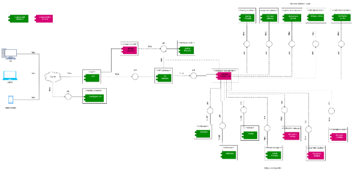

2. # Arquitectura de solución/referencia
La arquitectura de solución o referencia es la estructura general que define cómo estará construido y organizado un sistema de software. Esta arquitectura sirve como una guía para el desarrollo del proyecto, mostrando los componentes principales, las tecnologías utilizadas y la manera en que todos los elementos se comunican entre sí. Su objetivo es garantizar que el sistema sea organizado, seguro, escalable, mantenible y capaz de cumplir con las necesidades del negocio y de los usuarios. En el caso de EParking, la arquitectura de solución permite definir cómo funcionará la plataforma de alquiler y reserva de parqueaderos privados, estableciendo la relación entre el frontend, backend, base de datos y servicios externos.

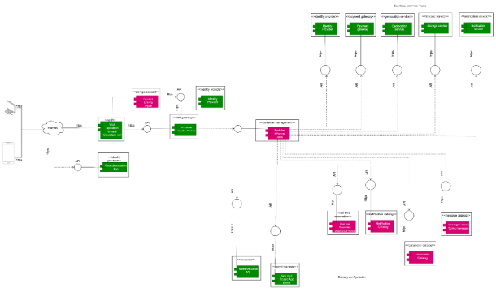

2. # Línea base arquitectónica
La línea base arquitectónica es la versión inicial y definida de la arquitectura de un sistema de software. Esta sirve como punto de referencia para el desarrollo del proyecto, ya que establece las decisiones principales sobre cómo estará construido el sistema, qué tecnologías se utilizarán y cómo se organizarán sus componentes.

4. ## Línea base arquitectónica de componentes
La línea base arquitectónica de componentes de EParking establece una estructura organizada y modular que permite separar responsabilidades dentro del sistema. Gracias a esta arquitectura, la plataforma puede garantizar seguridad, disponibilidad, mantenibilidad y escalabilidad, facilitando futuras mejoras y el crecimiento del proyecto.
2. ## Componente 1
API Gateway: La implementación de un API Gateway en EParking centraliza y protege las interacciones entre la aplicación, los usuarios y otros servicios. Actúa como un intermediario que gestiona, monitoriza y controla las solicitudes que llegan, permitiendo el acceso únicamente a usuarios autenticados. Esto ayuda a evitar amenazas como sobrecargas del sistema, intentos fraudulentos de acceso y manipulación de datos. También mejora el rendimiento al distribuir el tráfico de manera eficaz, permite escalar servicios con base en la demanda y simplifica la adición de nuevas características, asegurando que funciones críticas como reservas de estacionamiento, pagos y consultas en tiempo real se mantengan rápidas, seguras y siempre accesibles.

2. ## Componente 2
Notification Catalog: La puesta en marcha del sistema de notificaciones en EParking permite centralizar y automatizar la comunicación de mensajes (como avisos, recordatorios y alertas), garantizando que cada mensaje se envíe puntualmente y por el medio correcto. Esto previene confusiones y repeticiones, posibilita la personalización de los mensajes según el perfil del usuario, gestiona aumentos en la comunicación, aumentando la confianza y optimizando la experiencia del usuario.
2. ## Componente 3
Data base: Una base de datos confiable y eficiente en EParking es esencial para guardar y manejar datos importantes como usuarios, reservaciones, operaciones y existencia, asegurando organización, acceso veloz y defensa contra entradas no permitidas, daños o eliminaciones.
2. ## Componente 4
Infrastucture and security: La base de EParking se centra en su infraestructura y seguridad integral, la cual garantiza estabilidad, crecimiento y resguardo contra riesgos. Integra servidores, redes, sistema de almacenamiento y soluciones en la nube para manejar grandes volúmenes de trabajo y ajustarse a las necesidades sin interrupciones ni lentitud
2. ## Componente 5
Reservation Managament Component: El Módulo de Administración de Reservas en EParking organiza en tiempo real la ocupación de espacios, las preferencias de los usuarios y las normativas de aparcamiento, asegurando que reservar, cambiar o anular sea un procedimiento veloz, seguro y sin inconvenientes.
2. ## Componente 6
WAF: La puesta en marcha de un WAF en EParking funciona como una barrera defensiva que examina la totalidad del tráfico web para detectar conductas sospechosas. Así, asegura que la plataforma funcione sin interrupciones y que los datos sensibles, como las contraseñas o la información personal, permanezcan protegidos ante eventuales ciberataques, al impedir amenazas como accesos no autorizados, intentos de robo de datos y actividades maliciosas.
2. ## Componente 7
Monitoring Plataform: El funcionamiento de MP se asemeja al de un vigilante digital que controla en tiempo real el rendimiento de la aplicación, los servidores y otros servicios fundamentales. Esto permite detectar y solucionar problemas, como caídas, lentitud, ataques o errores técnicos, antes de que estos afecten a los usuarios. De esta manera, se garantiza que puedan realizarse sin inconvenientes operaciones esenciales, como la consulta de plazas libres o el procesamiento de transacciones. Además, compila información para optimizar la utilización de los recursos y asegurar que los datos del usuario sean accesibles y privados.
2. ## Componente 8 
Key vault: En EParking, el uso de un Key Vault se asemeja a una caja fuerte digital que resguarda y centraliza secretos delicados como las contraseñas, credenciales de API, claves de cifrado y certificados. De esta manera, se evita que estos datos queden descubiertos en la configuración o el código y se disminuye el peligro de errores humanos o ataques que puedan poner en riesgo información vital.
2. ## Componente 9
Messege Catalog: La comunicación textual de la plataforma EParking, que engloba indicaciones, etiquetas, fallas y notificaciones, se unifica y normaliza en el notificación de mensajes. Al actuar como una única base de datos, asegura que el tono, la forma y el contenido se mantengan coherentes en todas las interacciones con los usuarios.
2. ## Componente 10
BackEnd: El catálogo de mensajes unifica y normaliza la comunicación por texto de EParking, que comprende instrucciones, etiquetas, fallas y notificaciones. Como opera como una sola base de datos, asegura que el contenido, el tono y la forma se mantengan uniformes en todas las interacciones con los usuarios.
2. ## Componente 11
FrontEnd: La interfaz de EParking es el frontend, que conecta al usuario con el sistema y proporciona una experiencia fácil de usar e intuitiva. Permite efectuar de manera fácil operaciones como pagos, reservas y otras, las cuales se convierten en acciones que son visualmente nítidas y favorecen la interacción con la lógica del backend.
2. ## Componente 12
Identity and access managent: La adopción de la gestión de identidad y acceso en EParking garantiza que únicamente individuos o sistemas con autorización puedan acceder a los recursos. Evalúa identidades y distribuye permisos de manera central, resguardando información crítica y respetando regulaciones, todo sin perjudicar la experiencia del usuario
4. ## Estilos y patrones arquitectónicos adoptados
Definir los estilos arquitectónicos que guiarán el diseño del sistema EParking, asegurando escalabilidad, mantenibilidad y flexibilidad frente a futuras integraciones.
1. ##  Nombre
Arquitectura en capas (Layered Architecture)
1. ## ` `Problema
Cuando un sistema integra múltiples componentes (usuarios externos, servidores web, aplicación y base de datos), se necesita ordenar y separar responsabilidades para que cada parte cumpla un rol claro. Sin esta separación, el mantenimiento y la seguridad se vuelven complejos.
1. ##  Nombre
Arquitectura en Red Segura con DMZ (Demilitarized Zone)
1. ## ` `Problema
Los sistemas expuestos a Internet requieren proteger los recursos internos (base de datos, red interna) de accesos no autorizados. Si los servidores están directamente conectados a la red interna, se aumenta el riesgo de ataques.
1. ## ` `Solución/Motivación
Solo el servidor de aplicación y la base de datos tienen acceso controlado desde la DMZ. Esto reduce riesgos y asegura que los atacantes no puedan acceder directamente a la red interna.
## 7.2.3.1 Nombre
Arquitectura Cliente-Servidor
## 7.2.3.2 Problema
Los usuarios necesitan interactuar con el sistema desde dispositivos externos (ej. laptops, móviles). Sin un modelo claro de comunicación, la gestión de solicitudes y respuestas sería caótica.
## 7.2.3.3 Solución/Motivación
Servidor: web, aplicación y base de datos que procesan las solicitudes.

Esto asegura una comunicación estructurada, donde el cliente solicita y el servidor responde, manteniendo orden y escalabilidad.
2. # Justificación alternativa de solución
La alternativa de solución propuesta para EParking surge de la necesidad de brindar una solución tecnológica innovadora que permita aprovechar espacios privados disponibles como parqueaderos, generando ingresos adicionales para sus propietarios y facilitando a los conductores la búsqueda y reserva de espacios de manera rápida y segura. Actualmente, muchas personas cuentan con espacios vacíos que no generan ningún beneficio económico, mientras que los conductores enfrentan dificultades para encontrar parqueaderos disponibles en tiempo real. Además, aplicaciones tradicionales como Google Maps o Waze únicamente muestran ubicaciones, pero no garantizan disponibilidad, reservas ni pagos integrados dentro de la plataforma. Por esta razón, se propone desarrollar EParking como una aplicación web basada en una arquitectura moderna, escalable y segura, utilizando tecnologías como Angular para el frontend y Spring Boot para el backend, implementando APIs REST, arquitectura hexagonal y servicios en la nube. Esta alternativa permite construir un sistema organizado, mantenible y preparado para futuras mejoras y crecimiento.La solución también incorpora integración con servicios externos como Google Maps para geolocalización y pasarelas de pago digitales para realizar reservas seguras dentro de la plataforma. De esta manera, los usuarios podrán visualizar parqueaderos disponibles en tiempo real, realizar reservas anticipadas y efectuar pagos digitales desde cualquier dispositivo.

4. ## Justificación
La implementación de esta alternativa tecnológica permite reducir problemas de congestión, pérdida de tiempo en búsqueda de parqueaderos y desaprovechamiento de espacios privados, ofreciendo una solución beneficiosa tanto para conductores como para propietarios.En conclusión, la alternativa de solución de EParking se justifica porque responde a una necesidad real del entorno, utiliza tecnologías modernas y seguras, y proporciona una plataforma eficiente, escalable y confiable para la gestión de reservas y alquiler de parqueaderos privados.

4. ## Ventajas
La solución propuesta para EParking presenta múltiples ventajas, ya que permite monetizar espacios privados disponibles, ofreciendo a los propietarios una fuente de ingresos adicionales y facilitando a los conductores la búsqueda y reserva de parqueaderos en tiempo real. Además, integra pagos digitales seguros, una interfaz fácil de usar y una arquitectura escalable y organizada que permite el crecimiento futuro de la plataforma. Asimismo, el uso de tecnologías modernas y buenas prácticas mejora la seguridad, disponibilidad y mantenibilidad del sistema.Sin embargo, también existen algunas desventajas, como la dependencia de conexión a internet y de servicios externos como Google Maps y las pasarelas de pago. Además, el sistema requiere mantenimiento constante, medidas de seguridad adecuadas y costos de infraestructura en la nube. También pueden presentarse problemas si la información de disponibilidad no se actualiza correctamente o dificultades iniciales para que algunos usuarios se adapten al uso de la plataforma
4. ## Desventajas
La solución de EParking también presenta algunas desventajas que deben tenerse en cuenta durante el desarrollo y funcionamiento de la plataforma. Una de las principales es la dependencia total de una conexión a internet, ya que tanto la búsqueda de parqueaderos como las reservas y pagos digitales requieren acceso constante a la red. Además, el sistema depende de servicios externos como Google Maps, APIs de geolocalización y pasarelas de pago, por lo que cualquier falla en estos servicios podría afectar el funcionamiento de la aplicación. Por otro lado, la plataforma requiere mantenimiento continuo, actualizaciones frecuentes y monitoreo constante para garantizar un buen rendimiento, disponibilidad y seguridad. También existen costos asociados al uso de infraestructura en la nube, bases de datos y herramientas tecnológicas necesarias para soportar el sistema. Asimismo, debido a que EParking manejará información personal y transacciones digitales, es necesario implementar fuertes medidas de seguridad para evitar riesgos relacionados con ataques informáticos o pérdida de datos. Finalmente, pueden presentarse inconvenientes si los propietarios no actualizan correctamente la disponibilidad de sus espacios, lo que podría ocasionar errores en las reservas. Además, algunos usuarios podrían necesitar tiempo para adaptarse al uso de una plataforma digital para alquilar o reservar parqueaderos

2. # Vistas de arquitectura del sistema
Las vistas de arquitectura del sistema son representaciones que permiten mostrar el sistema desde diferentes perspectivas para entender mejor cómo funciona, cómo está organizado y cómo interactúan sus componentes.Cada vista se enfoca en un aspecto específico del software, ayudando a analizar la estructura, comportamiento, tecnologías y funcionamiento del sistema de manera más clara y organizada.Las vistas arquitectónicas son importantes porque permiten que desarrolladores, analistas y stakeholders comprendan el sistema desde diferentes puntos de vista, facilitando el diseño, mantenimiento y crecimiento del proyecto.
2. ## Vista de Despligue/Vista Desarrollo/Vista de Implementacion
La vista física o de implantación en el proyecto EParking representa cómo se distribuyen los distintos componentes del sistema dentro de la infraestructura tecnológica que lo soporta. Esta vista muestra de manera clara la organización de servicios, aplicaciones, bases de datos y recursos externos, así como la forma en que se comunican entre sí para ofrecer una solución integral de gestión de parqueaderos. Su propósito es facilitar la comprensión de la instalación, despliegue y operación de EParking, permitiendo visualizar cómo los dispositivos de los usuarios (móviles, portátiles y equipos de escritorio) se conectan a través de Internet con el núcleo de la aplicación. Desde allí, el sistema interactúa con elementos críticos como el API Gateway, el proveedor de identidades, la pasarela de pagos, los servicios de geolocalización, los componentes de notificaciones y las bases de datos SQL y NoSQL, además de recursos transversales como el caché, el baúl de secretos y los catálogos de mensajes y parámetros. Esta distribución física no solo permite validar la correcta integración de los recursos tecnológicos, sino que también ayuda a identificar aspectos clave relacionados con la seguridad (protección de datos y control de accesos), la disponibilidad (garantizar que el sistema esté siempre operativo), el rendimiento (tiempos de respuesta ágiles gracias al uso de caché y bases optimizadas) y la escalabilidad (capacidad de crecer mediante contenedores y servicios distribuidos).En conjunto, la vista de implantación asegura que EParking pueda desplegarse de manera ordenada, confiable y preparada para evolucionar frente a nuevas necesidades, ofreciendo a los usuarios una experiencia segura, rápida y consistente en la gestión de sus parqueaderos.

2. ## Diagrama de componentes
## 
El diagrama de componentes de EParking muestra todos los elementos que serán construidos o integrados para garantizar el funcionamiento completo del sistema. Incluye el núcleo de la aplicación, el API Gateway, el proveedor de identidades, la pasarela de pagos, los servicios de geolocalización y notificaciones, además de las bases de datos SQL y NoSQL, el caché, el baúl de secretos y los catálogos de mensajes y parámetros.Cada componente está relacionado de forma clara: el núcleo coordina la lógica de negocio, mientras que los servicios externos aportan seguridad, comunicación y procesamiento de pagos. Las bases de datos y el caché aseguran rendimiento y persistencia, y los catálogos garantizan consistencia en la configuración. En conjunto, esta distribución permite validar la integración tecnológica y asegura que EParking sea un sistema seguro, escalable y confiable
1. ## Componente 1
El núcleo de la plataforma EParking es el encargado de manejar todas las reglas y procesos principales del sistema. Su función es coordinar cómo se conectan los diferentes servicios y bases de datos mediante una API REST segura, que actúa como puente entre el usuario y la lógica interna. Para organizar mejor el desarrollo, se utiliza un enfoque de monolito modular, lo que significa que todo está dentro de una misma aplicación, pero dividido en módulos independientes. Esto facilita el mantenimiento, ya que cada parte puede actualizarse sin afectar al resto, y también permite que el sistema crezca de forma ordenada y escalable.
1. ## Diagrama

1. ## Documentación
El sistema **EParking** se construye sobre una arquitectura orientada a frameworks y librerías, donde el núcleo de la aplicación depende de componentes especializados que garantizan escalabilidad, mantenibilidad y facilidad de integración. El entorno de ejecución está dado por **Java 26**, que provee la base para ejecutar la aplicación. Sobre este entorno se apoya el **Spring Framework**, encargado de gestionar la inyección de dependencias, seguridad y soporte empresarial. Para simplificar la configuración y despliegue se utiliza **Spring Boot 4.0.6**, que automatiza procesos y reduce la complejidad del desarrollo. La persistencia de datos se maneja mediante **Spring JPA 4.0.6**, que facilita el mapeo objeto-relacional y la interacción con la base de datos. La conexión con **Microsoft SQL Server** se logra gracias al controlador **mssql-jdbc**, que asegura compatibilidad y comunicación eficiente con el motor de base de datos. Finalmente, el módulo principal **EParking** integra todas estas dependencias para ofrecer las funcionalidades de gestión de parqueaderos.Este estilo arquitectónico resuelve el problema de integrar múltiples tecnologías sin necesidad de configuraciones manuales extensas, y su motivación es reducir la complejidad, mejorar la mantenibilidad y acelerar el desarrollo. Los beneficios principales son la **escalabilidad** gracias al soporte de microservicios en Spring Boot, la **mantenibilidad** por la separación clara entre lógica de negocio y persistencia, la **compatibilidad** con SQL Server mediante JDBC y la **productividad** al disminuir código repetitivo y configuraciones manuales. En conjunto, esta arquitectura asegura que EParking sea un sistema robusto, flexible y preparado para evolucionar con nuevas necesidades.

1. ## Componente 2
El componente Spring Boot 4.0.6 es el encargado de que la aplicación EParking funcione de forma rápida y sencilla para el usuario. Gracias a él, el sistema se inicia sin configuraciones complicadas y puede responder de manera ágil a las solicitudes de reserva o consulta. El problema que resuelve es la dificultad de arrancar aplicaciones grandes con muchas librerías, y su motivación es ofrecer al usuario una experiencia fluida, con tiempos de respuesta cortos y un servicio estable. En otras palabras, Spring Boot asegura que el usuario pueda entrar, reservar y gestionar su parqueadero sin preocuparse por fallos técnicos o demoras innecesarias.
2. ## Diagrama 
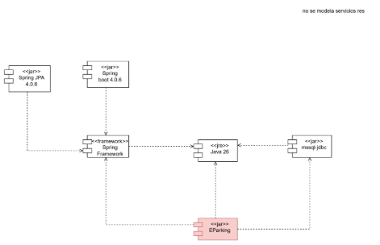

2. ## Documentación
La arquitectura del Front End de EParking está organizada en módulos y servicios que permiten mantener una estructura ordenada y sencilla de administrar. Dentro de esta capa se incluye un sistema de autenticación con JWT, que asegura la identidad de los usuarios y protege el acceso. La comunicación con el Backend se realiza de forma segura y confiable, garantizando que los datos viajen sin riesgos. Además, se implementa una gestión centralizada del estado de la aplicación, lo que facilita que la información mostrada siempre esté actualizada y coherente.La interfaz se construye con componentes reutilizables, lo que agiliza el desarrollo y asegura consistencia visual en toda la plataforma. Finalmente, se aplican mecanismos de seguridad basados en roles, de manera que cada usuario accede únicamente a las funciones que le corresponden, reforzando la protección y mejorando la experiencia de uso
2. ## Diagrama de paquetes
Un **diagrama de paquetes** es una representación visual en UML que muestra cómo se organiza un sistema en **grupos o módulos lógicos llamados paquetes**. Cada paquete agrupa clases, componentes o elementos relacionados, y las flechas indican las **dependencias** entre ellos.Su motivación principal es ofrecer una visión clara y comprensible de la **estructura del sistema**, mostrando qué partes dependen de otras y cómo se relacionan. En pocas palabras, sirve para ordenar el software en bloques fáciles de entender y mantener, evitando que el sistema se vea como un conjunto desordenado de clases sueltas.

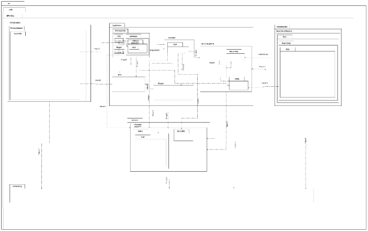
1. ## Componente 1
El **Componente 1 (Controller dentro del PrimaryAdapter)** tiene como motivación principal servir de puente directo entre el usuario y el sistema. Su razón de ser es recibir las solicitudes que el usuario realiza —como reservar un parqueadero, consultar disponibilidad o gestionar pagos— y traducirlas en instrucciones comprensibles para las capas internas de la aplicación.La motivación de este componente es garantizar que la interacción sea **simple, clara y segura**, evitando que el usuario tenga que enfrentarse a la complejidad técnica del sistema. En otras palabras, el Controller existe para que el usuario pueda comunicarse con EParking de manera intuitiva, confiando en que sus acciones se procesarán correctamente y que la experiencia será fluida y confiable.
1. ## Diagrama
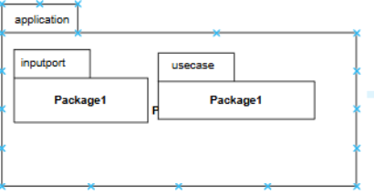

1. ## Documentación
tiene como motivación principal servir de puente entre el usuario y el sistema. Su función es recibir las solicitudes que el usuario realiza en la interfaz —como reservar un parqueadero o consultar disponibilidad— y traducirlas en instrucciones claras para las capas internas. La motivación es garantizar que la interacción sea simple y segura, permitiendo que el usuario se comunique con EParking de manera intuitiva y confiable.
1. ## Componente 2
tiene como motivación mantener el estado coherente de la aplicación frente a las acciones del usuario. Actúa como intermediario entre la interfaz y los servicios, asegurando que los datos mostrados estén siempre actualizados y que las operaciones se procesen de forma ordenada. Su motivación es ofrecer al usuario una experiencia fluida, donde cada acción se refleje inmediatamente en la aplicación sin inconsistencias ni errores.
1. ## Vision
Para dueños de espacios privados disponibles para alquilar que te ha pasado que te falta dinero para el hogar y cuentas con un espacio vacío que no usas ni le sacas provecho, pues con nuestro producto podrás alquilar y reservar ese espacio al publico como parqueadero. EasyPark es una Aplicacion wed con integración de reservas que Facilita ganar un dinero extra por medio del alquiler o reserva, A diferencia de aplicaciones como Google Maps o Waze, nuestro producto permitira una disponibilidad real del parqueadero, reserva de espacios y pago por la app nuestro producto Plataforma enfocada en monetizar espacios privados, con gestión en tiempo real de disponibilidad, reservas seguras y pagos integrados
1. ## Mapa de impacto
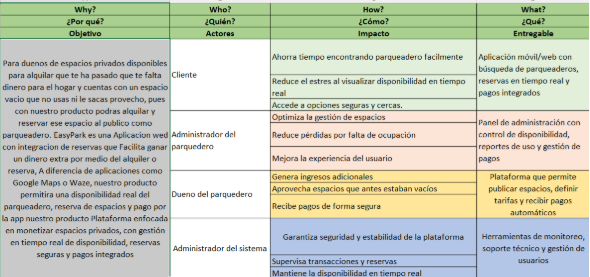
2. ## Diagrama de secuencia
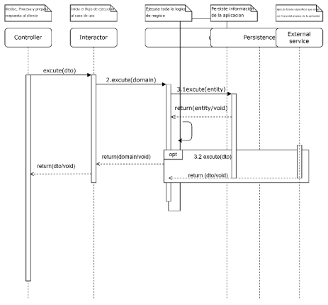
1. ## Componente 1
tiene como motivación principal ser el punto de entrada de todas las solicitudes que llegan desde el cliente. Su función es recibir, procesar y preparar la respuesta que se enviará de vuelta al usuario. La razón de existir de este componente es simplificar la interacción: el usuario no necesita conocer la lógica interna ni los detalles técnicos, solo confía en que al realizar una acción (como reservar un parqueadero o consultar disponibilidad) el sistema responderá de manera clara y rápida. En términos comprensibles, el Controller asegura que cada petición del usuario se traduzca en un flujo ordenado dentro de la aplicación, garantizando una experiencia confiable y sin fricciones.
1. ## Diagrama
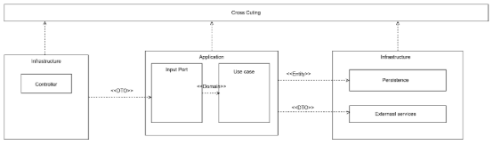
1. ## Documentación
El diagrama de secuencia de la muestra cómo se inicia el flujo de interacción en el sistema. El Controller recibe la solicitud del cliente, la procesa y prepara la respuesta. A partir de ahí, delega la ejecución al **Interactor**, que activa el **Caso de Uso**. Este último ejecuta la lógica de negocio, interactúa con la capa de **Persistencia** para guardar información y, cuando es necesario, se comunica con **Servicios Externos** para realizar tareas fuera del alcance de la aplicación. La documentación evidencia que el Controller es el punto de entrada y coordinación inicial, garantizando que cada petición del usuario siga un flujo ordenado y seguro hasta obtener una respuesta final.
1. ## Componente 2
El **Componente 2 (Interactor)** tiene como motivación principal iniciar el flujo de ejecución hacia el caso de uso correspondiente. Su función es recibir la instrucción del Controller y dirigirla al bloque de lógica de negocio adecuado. La motivación de este componente es asegurar que las solicitudes del usuario se canalicen correctamente, activando el proceso exacto que corresponde a cada acción. En términos sencillos, el Interactor es el encargado de poner en marcha la maquinaria interna del sistema, garantizando que cada petición se traduzca en una operación precisa y eficiente.
1. ## Diagrama de despliegue
El diagrama de despliegue de EParking muestra cómo se distribuyen físicamente y lógicamente los distintos componentes dentro de la infraestructura tecnológica que soporta la solución. Su objetivo es representar la interacción entre las partes de la arquitectura —como el frontend, el backend, las bases de datos, los servicios internos y externos— y evidenciar la manera en que se comunican entre sí.La motivación de este diagrama es ofrecer una visión clara de la ejecución del sistema, destacando los protocolos de comunicación, las dependencias entre módulos y la organización de los recursos necesarios para que la plataforma funcione correctamente. Además, permite identificar aspectos clave relacionados con la seguridad, la disponibilidad, el rendimiento y la escalabilidad, asegurando que EParking pueda operar de manera confiable y eficiente.

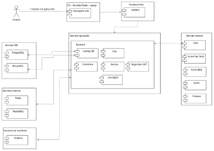
1. ## Documentación
La documentación del diagrama de arquitectura de EParking describe cómo se organizan y comunican los distintos componentes que conforman la solución. Los usuarios acceden desde dispositivos como PC, móviles, tablets o laptops a través de un navegador web, que se conecta con el Frontend, encargado de la presentación y la interacción inicial. Desde allí, las solicitudes pasan al Servidor de Aplicación (Backend), que concentra la lógica del sistema mediante módulos como controladores, servicios, seguridad con JWT, API REST, registro de eventos y la interfaz de conexión con las bases de datos. El Servidor de Base de Datos integra tecnologías como PostgreSQL y MongoSQL, permitiendo manejar información estructurada y no estructurada. Para optimizar rendimiento y comunicación interna, se emplean servicios como Redis (caché) y RabbitMQ (mensajería), mientras que la supervisión del sistema se realiza con Grafana, que facilita el monitoreo en tiempo real. Además, el sistema se apoya en servicios externos como PSE para pagos, Azure Key Vault para gestión de secretos, Azure Blob para almacenamiento, Auth0 para autenticación avanzada y Firebase para funcionalidades adicionales. En conjunto, esta arquitectura asegura que EParking sea un sistema seguro, escalable y confiable, validando aspectos de comunicación, integración, disponibilidad y protección de datos, y ofreciendo a los usuarios una experiencia eficiente y consistente.
1. ## Componente 1
La documentación de componentes de EParking describe cada uno de los elementos que forman parte de la solución y cómo se relacionan entre sí para garantizar su correcto funcionamiento. En el Frontend, se incluyen módulos de interfaz y autenticación que permiten al usuario acceder de manera segura, apoyados en mecanismos como JWT y comunicación cifrada con el Backend. El Backend concentra la lógica de negocio y está compuesto por controladores, servicios, API REST y un sistema de seguridad que regula el acceso según roles.En la capa de persistencia, se utilizan bases de datos como PostgreSQL y MongoSQL para manejar información estructurada y no estructurada, complementadas con Redis para caché y RabbitMQ para mensajería interna. La gestión de monitoreo se realiza con Grafana, que permite supervisar métricas y el estado del sistema en tiempo real.Finalmente, se integran servicios externos como PSE para pagos, Azure Key Vault para la gestión de secretos, Azure Blob para almacenamiento, Auth0 para autenticación avanzada y Firebase para funcionalidades adicionales de comunicación. En conjunto, estos componentes aseguran que EParking sea un sistema seguro, escalable y confiable, validando aspectos de integración, disponibilidad y rendimiento, y ofreciendo a los usuarios una experiencia eficiente y consistente.
1. ## Diagrama 
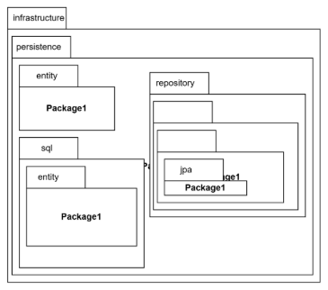
1. ## Documentacion
El diagrama refleja la estructura de persistencia dentro de la infraestructura de EParking. Se organiza en capas y paquetes que permiten manejar de manera ordenada la información del sistema. La sección principal es Persistence, que agrupa los elementos relacionados con el almacenamiento y acceso a datos. Dentro de ella se encuentran los módulos de Entity, SQL y Repository, cada uno con sus respectivos paquetes. Esta organización facilita la separación de responsabilidades y asegura que la lógica de acceso a datos esté claramente definida y mantenida.La documentación evidencia cómo los distintos paquetes se relacionan jerárquicamente: las entidades representan los objetos del dominio, el módulo SQL gestiona las consultas y operaciones sobre la base de datos, y el Repository actúa como intermediario entre la lógica de negocio y la persistencia. Además, dentro del repositorio se incluyen subcomponentes como JPA y Entity, que permiten implementar patrones estandarizados para el acceso y manipulación de datos.
1. ## Componentes 1
Entity: Define las estructuras de datos que representan los objetos del dominio del sistema (ej. usuarios, reservas, pagos).SQL: Contiene las consultas y operaciones específicas sobre la base de datos relacional, garantizando integridad y consistencia. Repository: Intermediario que conecta la lógica de negocio con la capa de persistencia.JPA: Implementa el acceso a datos mediante estándares de persistencia, facilitando la integración con bases relacionales.Entity (dentro del repositorio): Refuerza la definición de objetos persistentes y su relación con las tablas de la base de datos.
1. ## Diagrama 
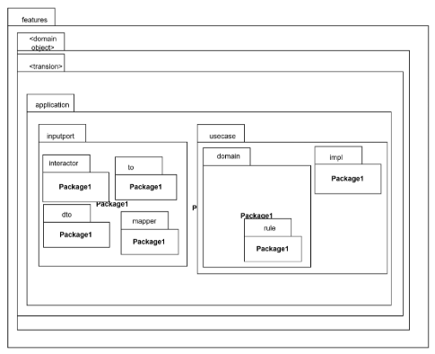
1. ## Documentación
El diagrama refleja la organización interna de la capa de aplicación de EParking, mostrando cómo se estructuran los módulos y paquetes que soportan la lógica de negocio. La sección principal es Application, dividida en dos áreas: InputPort y UseCase. Dentro de InputPort se encuentran elementos como el Interactor, los objetos de transferencia (DTO), el Mapper y otros paquetes que permiten recibir las solicitudes del usuario y transformarlas en operaciones comprensibles para el sistema. Por otro lado, la sección UseCase contiene los módulos de Domain y Impl, donde se definen las reglas de negocio y sus implementaciones.La documentación evidencia que esta organización modular facilita la separación de responsabilidades: los puertos de entrada gestionan la comunicación con el exterior, mientras que los casos de uso concentran la lógica central del sistema. Esto asegura claridad, mantenibilidad y escalabilidad en el desarrollo de EParking.
1. ## Componente 1
**InputPort**:

- **Interactor**: Coordina la ejecución de los casos de uso.
- **DTO (Data Transfer Object)**: Transporta datos entre capas de manera estructurada.
- **Mapper**: Transforma datos entre entidades y objetos de transferencia.
- **TO (Transfer Object)**: Complementa la comunicación entre módulos.
  1. ## Componentes 2
**UseCase**:

- **Domain**: Define las reglas de negocio y las entidades principales del sistema.
  - **Rule**: Contiene las normas y validaciones que rigen el comportamiento del sistema.
- **Impl (Implementación)**: Concreta la lógica definida en el dominio, asegurando que las reglas se ejecuten correctamente.

2. ## Diagrama de despliegue
![ref1]
1. ## Diagrama
El diagrama de objetos del sistema EParking muestra cómo los distintos elementos interactúan en tiempo de ejecución. En él se representan los dispositivos de los usuarios (móvil, laptop, escritorio) conectados a través de Internet hacia el núcleo de la aplicación. Desde allí, el sistema se relaciona con objetos clave como el API Gateway, las bases de datos SQL y NoSQL, el servicio de geolocalización, la pasarela de pagos, el componente de notificaciones, el caché, el baúl de secretos y otros catálogos de parámetros y mensajes. Cada objeto cumple un rol específico y se comunica con el núcleo de EParking para garantizar que las operaciones de reserva, pago y notificación se ejecuten de manera segura y eficiente.
1. ## Documentación
El diagrama de paquetes del sistema **EParking** organiza los componentes en módulos lógicos que facilitan la comprensión y el mantenimiento. Los paquetes principales incluyen:

**Infraestructura**: donde se ubican elementos como el API Gateway, el firewall de aplicaciones web y los servicios externos (pagos, geolocalización, notificaciones).

**Aplicación**: núcleo de EParking, encargado de coordinar la lógica de negocio y conectar con los servicios.

**Persistencia**: paquetes que agrupan las bases de datos SQL y NoSQL, junto con el caché y el baúl de secretos.

**Crosscutting**: funcionalidades transversales como catálogos de mensajes, parámetros y notificaciones.

La documentación evidencia que EParking adopta una arquitectura modular y distribuida, donde cada paquete tiene responsabilidades claras y se comunica mediante interfaces bien definidas. Esto asegura escalabilidad, seguridad y facilidad de evolución del sistema.

[ref1]: Aspose.Words.e87b8ccd-cdbf-43c9-af50-53fbc80b5e66.001.png
